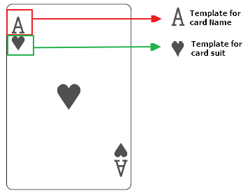
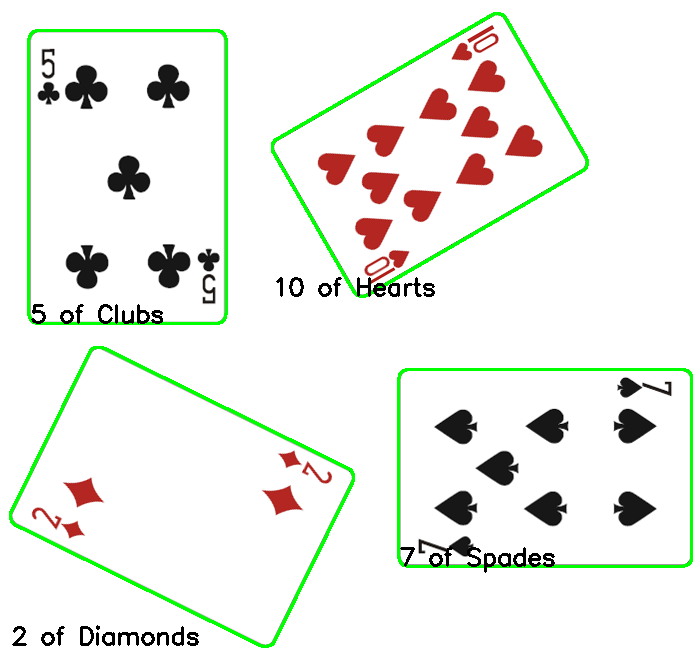

# Card Detector using Computer Vision 

## Overview

This project was initially developed during a College Course on Computer vision from UFSC (Santa Catarina Federal University).  In this couse, we used MATLAB image processing features. 

The obtained performance using MATLAB was not optimal. So, in this project we tried to achieve better results by using OpenCV module in Python.  

The results using OpenCV library were far better than the ones from the College Course. This shows that python is more recommended for Image Processing tasks than MATLAB.

## Objectives

The objectives are described in the list below:

- Develop a logic to detect cards from an input image, given whatever orientation.
	- Filter Image
	- Find Cards and Contours
	- Detect Card Orientation (Rotate if necessary)
	- Apply Homography Transformation

- Apply Image Processing techniques in images to  extract a Template for Template Match function.

- Apply Template Match function (from OpenCV module) to categorize the input card into the correct number/name and suit. 

- Implement the detection code for Videos in Webcam video stream (to do).

## Procedures

#### Card Detection

#### Template
The template used for TemplateMatch function is extracted from each image available on the *Templates* Folder. 

#### Template Match Result
For Template Matching, the chosen method was *TM_CCOEFF_NORMED* (**T**emplate **M**atching  **C**orrelation **C**oefficient **N**ormalized)

The result is exemplified in the image below.

